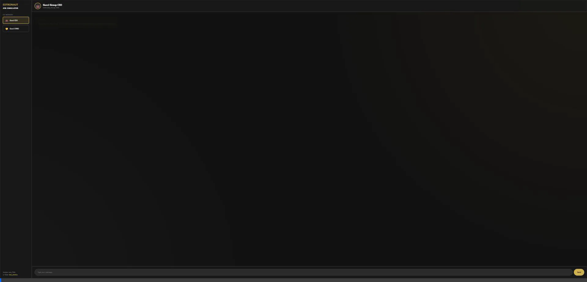

# Edtronaut AI Co-Worker Engine 🚀



An Enterprise-grade "AI Co-Worker" simulation prototype built for the **Edtronaut AI Engineer Intern Take-home Assignment**. This system goes beyond a standard chatbot by implementing a **Multi-Agent LangGraph Architecture** connected to a **Dynamic Web UI**.

## 🌟 Key Features

1. **Multi-Persona State Routing**: Seamlessly switch between the **Gucci Group CEO** (defending brand autonomy) and the **Gucci Group CHRO** (focusing on competency frameworks).
2. **Internal AI Gossip (Cross-Reference)**: If you upset the CEO, they will leave a hidden backend note for the CHRO. When you switch tabs to talk to the CHRO, they will know about your previous mistakes!
3. **UI-State Awareness (Director Node)**: A supervisor AI (The Director) runs invisibly. If it detects you are viewing the *KPI Calculator* tool and getting stuck, it will whisper hints into the active NPC's prompt to guide you.
4. **Structured JSON Output**: The AI doesn't just return text. It returns structured JSON (Dialogue, Emotion, UI Triggers). The frontend parses this to dynamically change the NPC's avatar emotion (😠 / 😊) and trigger UI animations (like sliding out the KPI tool).
5. **Memory Summarization**: A dedicated LangGraph node summarizes long conversations to prevent context window overflows and reduce API costs.

## 🛠️ Tech Stack

- **Backend Model**: Google Gemini (`gemini-2.5-flash`) via `langchain-google-genai`.
- **Orchestration**: **LangGraph** (State Machine) & **LangChain**.
- **API Framework**: **FastAPI** (with CORS and static file rendering).
- **Frontend**: Vanilla HTML/CSS/JS with Glassmorphism UI & Dark Mode.

## 🚀 How to Run Locally

1. **Clone the repository:**

   ```bash
   git clone https://github.com/Phucgiacat/edtronaut-ai-coworker-engine.git
   cd edtronaut-ai-coworker-engine
   ```
2. **Set up a Virtual Environment & Install Dependencies:**

   ```bash
   python -m venv venv
   source venv/Scripts/activate  # On Windows PowerShell
   pip install -r requirements.txt
   ```
3. **Start the FastAPI Server:**

   ```bash
   python main.py
   ```

   *(Note: A valid Google Gemini API Key is embedded in the prototype for demo purposes. If it expires, please replace `GOOGLE_API_KEY` in `main.py`).*
4. **Experience the UI:**
   Open your browser and navigate to: **`http://localhost:8000`**
